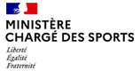
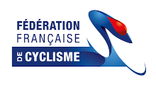
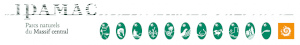
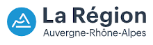
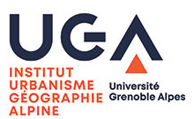
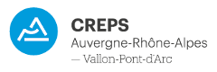

**Des marques d’objets connectés soutiennent la démarche**     
      
   
Garmin fourni une technologie GPS innovante dans divers marchés comme l’aviation, la marine, le sport, les loisirs de plein air, le suivi et les applications mobiles.
***
   
Marque finlandaise de montres de sport, experte de l’orientation et l’aventure depuis 1936. Suunto a mobilisé sa communauté sportive et facilité le transfert des traces de celle-ci vers la plateforme Outdoorvision, améliorant ainsi la fiabilité du projet Outdoorvision.
***
   
L'application Visorando permet de se servir de son smartphone ou de sa tablette comme d'un GPS de randonnée. L'application convient pour la randonnée pédestre, la randonnée VTT, à ski, en raquettes et à cheval.   
Étant sensible à la qualité des sites et des itinéraires, Visorando s’est engagé dans leurs préservations via le projet Outdoorvision.
***
   
VisuGPX est un site de création, d'analyse et de partage d'itinéraires GPS. Participer à ce projet est un choix de bon sens. Donner de la visibilité à nos itinéraires et à nos pratiques, c'est aider les décideurs dans leurs futurs choix de préservation et d'aménagement de nos terrains de jeu favoris.
***
      

**Avec le soutien opérationnel, technique ou financier de :**   

|||
   
